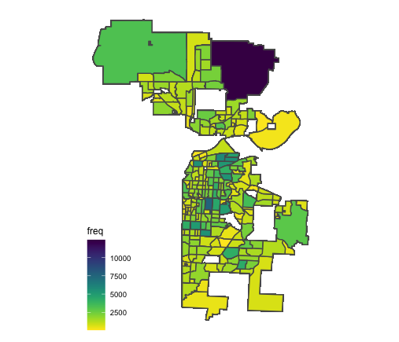
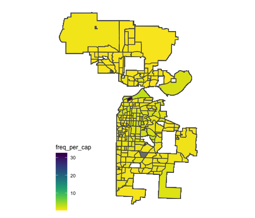
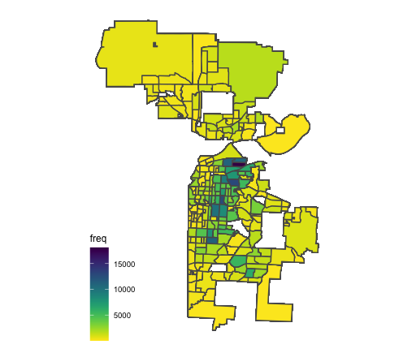
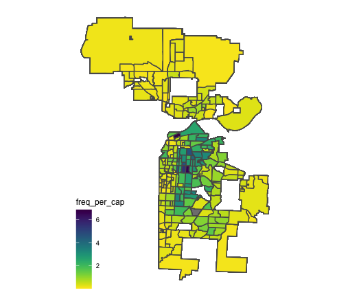
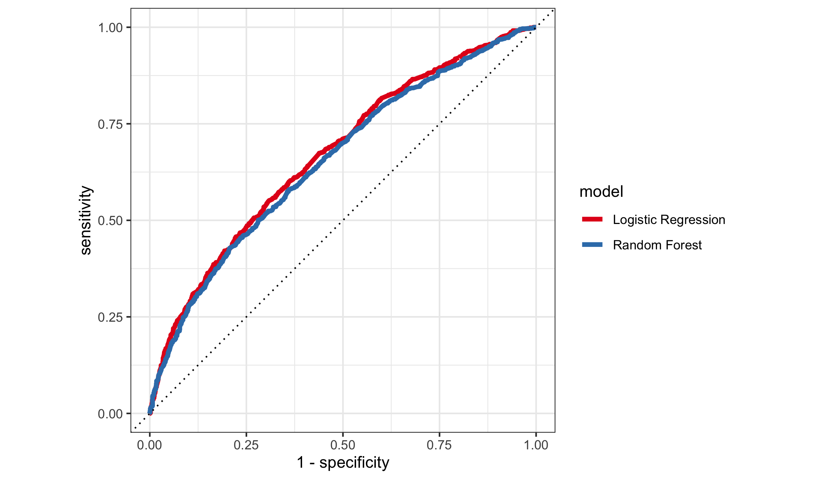
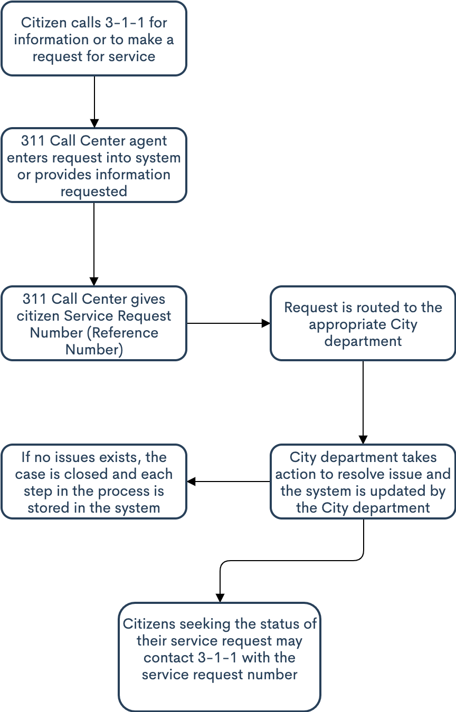

```{r, setup, include=FALSE}
require(mosaic)   # Load additional packages here 

library(tidyverse)
library(kableExtra)
library(ggthemes)

knitr::opts_chunk$set(
  tidy = FALSE,     # display code as typed
  size = "small",   # smaller text for code
  echo = FALSE      # don't show code
  )   
```

\doublespacing

## Introduction

Many cities use 311 systems to capture non-emergency complaints of their citizens in real time [@nyc_311]. These cities include Austin, New York, Kansas City, Washington, DC, and more. In parallel, access to these data are often granted to the public via open data portals. These portals allow access to many types of city metrics, including: traffic, 311, city governance, and transit. This data availability has led to many governance decisions. For example, the New York City Fire Department (FDNY) uses a tool called FireCast 3.0 to analyze three years’ worth of data for every building in the city and assign a fire risk score.^[\url{https://www.nfpa.org/-/media/Files/News-and-Research/Resources/Research-Foundation/Current-projects/Smart-FF/SmartFFNFPAJournalDataDriven.ashx}] Data availability combined with smart governance allows a city department to be more effective in their response. 

However, some instances of city department response may be prone to bias. Bias can also exist in the ways that residents make use of city services, in addition to bias of response to them. Here, I ask who is asking for help from their city government? I make use of 311 data, publicly available from Kansas City's (KC) OpenData portal, in conjunction with results from a citizen satisfaction survey administered by the Kansas City Office of Performance Management (OPM) to explore potential bias in 311 reporting [@kcmo_311; @kcmo_css].

The use of the citizen satisfaction survey, administered quarterly, provides depth to the 311 data, allowing me to estimate likelihood of 311 contact from demographic and socioeconomic characteristics as well as political engagement and overall citizen satisfaction. The survey is a stratified sample across city council districts based on a balanced population against census demographics. 

Following @kontokosta2018, I hypothesize that increased citizen satisfaction and political participation is associated with increased likelihood for 311 usage. This paper is organized as follows: section two describes the data sources and estimation methodology, section three presents the results, and section four concludes.

## Data and Methods

I integrate numerous datasets, described in Table \ref{tab:data_source}, to pursue the research question of whether there is bias in 311 usage. OPM graciously provided me with the data for the citizen satisfaction survey. This survey samples "are stratified across the city council districts based on a statistically significant random sample of the balanced population against census demographics, and responses are collected via mail, phone, and webpage" [@kcmo_css]. The 311 reports and property violations data capture local disparities in 311 calls and outcomes. Figure 3 illustrates the 311 service request process. 

\input{"../Tables/dataset_desc.tex"}

Figure 1 illustrates the spatial patterns of 311 call and response. According to the survey, 47\% have reported using 311 at least once. In 2016, 103,955 complaints were reported. Of the total reported, 54\% (55,743) were related to code enforcement, which is handled by the Neighborhoods and Housing Services Department (NHS). The NHS provides inspections and will close the case unless and inspection is found. Of the cases given the NHS, 22\% (12,411) ended up with served violations. A single 311 call that is routed to the NHS can yield many violations. These 12,411 calls that yielded violations, resulted in 71,356 separate violations. The location of these vary wildly over the city.

```{r map_figs, fig.cap='Spatial patterns of 311 reports and property violations', fig.align='center', fig.ncol = 2, out.width = "45%", fig.subcap=c('311 reports at neighborhood level', '311 reports per capita at neighborhood level', 'Property violations at neighborhood level', 'Property violations per capita at neighborhood level')}






```

The survey data provides insight on the demographics of households that have and have *not* contacted 311. Since the survey data is random sample across neighborhoods, there should be no disparity due to individual level factors. The survey is split on a single question:

> "*Have you or anyone in your household contacted City's 311 Call Center in the past year?*"

I then use relevant characteristics from the survey to predict the likelihood of 311 usage. To predict the likelihood of 311 usage, I develop two models: a logistic regression and a random forest model. The dependent variable is the binary response to above question:

- **0** (311 User) : Respondent has used 311
- **1** (311 Non-User): Respondent has not used 311

The coefficients used, and their categories/type are in Table \ref{tab:variables}.

\input{"../Tables/var_input.tex"}

## Results

\input{"../Tables/lr_coef.tex"}


test3

```{r, results='asis', out.width="80%", fig.align='center', fig.cap="ROC (Receiver Operating Characteristics) Curve of the logistic regression and random forest model"}

```

test4


## Conclusion


\newpage
\singlespacing
\onecolumn

# References

<div id="refs"></div>

\pagebreak

# Appendices {-} 

## Appendix A -- 311 Request Process

```{r, results='asis', out.width="45%", fig.align='center', fig.cap="311 Service Request Process"}

```

## Appendix B -- Session Information

(Not run)

```{r eval=FALSE}
sessionInfo()  
```
  