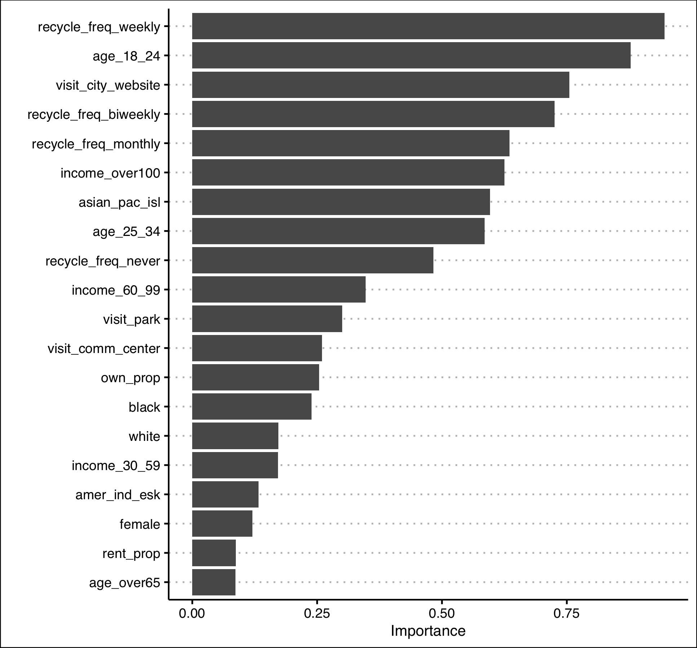

```{r, setup, include=FALSE}
require(mosaic)   # Load additional packages here 

library(tidyverse)
library(kableExtra)
library(ggthemes)

knitr::opts_chunk$set(
  tidy = FALSE,     # display code as typed
  size = "small",   # smaller text for code
  echo = FALSE      # don't show code
  )   
```

\doublespacing

## Introduction

Many cities use 311 systems to capture non-emergency complaints of their citizens in real time [@nyc_311]. These cities include Austin, New York, Kansas City, Washington, DC, and more. In parallel, access to these data are often granted to the public via open data portals. These portals allow access to many types of city metrics, including: traffic, 311, city governance, and transit. This data availability has led to many governance decisions. For example, the New York City Fire Department (FDNY) uses a tool called FireCast 3.0 to analyze three years’ worth of data for every building in the city and assign a fire risk score.^[\url{https://www.nfpa.org/-/media/Files/News-and-Research/Resources/Research-Foundation/Current-projects/Smart-FF/SmartFFNFPAJournalDataDriven.ashx}] Data availability combined with smart governance allows a city department to be more effective in their response. 

However, some instances of city department response may be prone to bias. Bias can also exist in the ways that residents make use of city services, in addition to bias of response to them. Here, I ask who is asking for help from their city government? I make use of 311 data, publicly available from Kansas City's (KC) OpenData portal, in conjunction with results from a citizen satisfaction survey administered by the Kansas City Office of Performance Management (OPM) to explore potential bias in 311 reporting [@kcmo_311; @kcmo_css].

The use of the citizen satisfaction survey, administered quarterly, provides depth to the 311 data, allowing me to estimate likelihood of 311 contact from demographic and socioeconomic characteristics as well as political engagement and overall citizen satisfaction. The survey is a stratified sample across city council districts based on a balanced population against census demographics. 

Following @kontokosta2018, I hypothesize that increased citizen satisfaction and political participation is associated with increased likelihood for 311 usage. Largely, I replicate their research process. Although, it should be noted that they do not publish their code or data (or respond to emails). All data-pulls, cleaning, and model creation is mine (errors included). This paper is organized as follows: section two describes the data sources and estimation methodology, section three presents the results, and section four concludes.

## Data and Methods

I integrate numerous datasets, described in Table \ref{tab:data_source}, to pursue the research question of whether there is bias in 311 usage. OPM graciously provided me with the data for the citizen satisfaction survey. This survey samples "are stratified across the city council districts based on a statistically significant random sample of the balanced population against census demographics, and responses are collected via mail, phone, and webpage" [@kcmo_css]. The 311 reports and property violations data capture local disparities in 311 calls and outcomes. Figure 3 illustrates the 311 service request process. 

\input{"../Tables/dataset_desc.tex"}

Figure 1 illustrates the spatial patterns of 311 call and response. According to the survey, 47\% have reported using 311 at least once. In 2016, 103,955 complaints were reported. Of the total reported, 54\% (55,743) were related to code enforcement, which is handled by the Neighborhoods and Housing Services Department (NHS). The NHS provides inspections and will close the case unless and inspection is found. Of the cases given the NHS, 22\% (12,411) ended up with served violations. A single 311 call that is routed to the NHS can yield many violations. These 12,411 calls that yielded violations, resulted in 71,356 separate violations. The location of these vary wildly over the city.

```{r map_figs, fig.cap='Spatial patterns of 311 reports and property violations', fig.align='center', fig.ncol = 2, out.width = "45%", fig.subcap=c('311 reports at neighborhood level', '311 reports per capita at neighborhood level', 'Property violations at neighborhood level', 'Property violations per capita at neighborhood level')}


knitr::include_graphics("../Figures/prop_viol_at_nbhd_level.png")


```

The survey data provides insight on the demographics of households that have and have *not* contacted 311. Since the survey data is randomly sampled across neighborhoods, there should be no disparity due to individual level factors. The survey is split on a single question:

> "*Have you or anyone in your household contacted City's 311 Call Center in the past year?*"

I then use relevant characteristics from the survey to predict the likelihood of 311 usage. To predict the likelihood of 311 usage, I develop two models: a penalized logistic regression and a random forest model. The dependent variable is the binary response to above question:

- **0** (311 User) : Respondent has used 311
- **1** (311 Non-User): Respondent has not used 311

The coefficients used, and their categories/type are in Table \ref{tab:variables}. 

\input{"../Tables/var_input.tex"}

The logistic regression uses a tuned penalty hyperparameter to give less weight to less relevant predictors in the modeling process. This penalty is the total amount of regularization in the model and is tuned over an expanded grid with the alpha value. I have set $\alpha = 1$ in this specification, leading to a pure LASSO.

The random forest model uses two tuned hyperparameters with 1000 trees: `mtry` and `min_n`. These are the number of variables to possibly split at each node and the minimal node size, respectively. Again, these are tuned over an expanded grid. This process is sped up using parallelization.

## Results

Table 3 and Figure 2 show the results of the logistic model. Figure 2 also shows the results of the random forest model. Both results perform similarly (AUC of 0.67 and 0.655). These are comparable with the results of @kontokosta2018 who achieve an AUC of 0.69 using a logistic regression.^[No details are given in their paper about how they clean or adjust covariates.]

\input{"../Tables/lr_coef.tex"}

```{r auc_plot, results='asis', out.width="80%", fig.align='center', fig.cap="ROC (Receiver Operating Characteristics) Curve of the logistic regression and random forest model"}
knitr::include_graphics("../Figures/final_auc_plot.png")
```

The results suggest that older women with lower incomes, are non-white, and are property owners are more likely to make use of 311 services. The intuition behind these demographics make sense. Households with lower income may be more reliant on these services to take care of non-emergencies and households with lower incomes may be more likely to face these issues in the first place. Since the survey is anonymous and unable to be linked directly to census data and voting records, these kind of extrapolations are made with caution.

Further, as hypothesized, civic engagement seems to be more strongly associated with usage of 311 services. Those who visit one or more of the city website, the community website, and park, as well as those who recycle, are associated most strongly with 311 service requests. This might suggest that interaction with city governance more regularly might make a household more aware that 311 is available, or increase the service's salience in their life. Figure 4 in Appendix A illustrates measures of variable importance for both models.

Overall, these results suggest non-trivial associations with between socioeconomic characteristics, civic engagement, and citizen satisfaction with 311 reporting behavior.

## Conclusion

Previous studies on 311 reporting has to extrapolate the characteristics of the household making the report from unlinked census data about the area. Information is thus limited to expected income for the building, and other associated characteristics with the neighborhood or block-level characteristics. This was an obstacle in analyzing 311 data from New York City's OpenData portal, as well as other cities. The citizen satisfaction survey in Kansas City is unique in that it allows for a link between 311 usage and characteristics of interest that allow the city to understand how their services are being used and to what extent they are valued. This survey allows for a novel exploration of the factors that contribute to understanding who uses 311 and potential bias in usage -- which leans towards already engaged citizens. The results are unsurprising, but indicates larger questions about who is engaged in city governance and city life, and further bias that may hinder or encourage engagement. As the preliminary results here demonstrate, this likely falls on demographic and socioeconomic lines. Further research should focus on the institutions that enable residents to be more participatory (ease of access?) and how local governance exhibits bias in their response to calls by citizens.

## Acknowledgements

I'd like to thank the the Kansas City Office of Performance Management for providing the data used in this study. In particular, Kate Bender was very gracious in expeditiously helping me get data from OPM and jump through the necessary bureaucratic hoops. As always, thank you Stack Exchange contributors.

\newpage
\singlespacing
\onecolumn

# References

<div id="refs"></div>

\pagebreak

# Appendices {-} 

## Appendix A -- Figures

```{r, results='asis', out.width="45%", fig.align='center', fig.cap="311 Service Request Process"}

```

```{r vip_figs, fig.cap='Variable importance', fig.align='center', fig.ncol = 2, out.width = "50%", fig.subcap=c('Logistic regression', 'Random Forest')}


knitr::include_graphics("../Figures/rf_vip.png")

```

\newpage

## Appendix B -- Session Information

```{r eval=TRUE}
sessionInfo()  
```
  